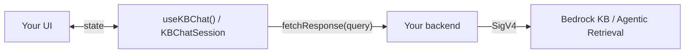

# sample-bedrock-kb-chat-widget

**This is a code sample, not a maintained package or supported dependency.** It
demonstrates one way to render Bedrock Knowledge Bases / Agentic Retrieval streaming
responses — parsing streamed text, citations, snippets, and Agentic Retrieval
progress stages, plus a pre-styled embeddable widget built on top of that. Fork it,
copy pieces of it, or use it purely as a reference for your own integration; there's
no expectation of ongoing releases or bug fixes here.

No AWS credentials in the browser: your own backend calls Bedrock, everything here
only renders what that backend streams back.

> **This is sample code, for non-production usage.** You should work with your security
> and legal teams to meet your organizational security, regulatory, and compliance
> requirements before deployment.

## What's here

- **[`kb-chat-core`](packages/kb-chat-core/README.md)** — framework-agnostic
  `KBChatSession` class. Owns stream parsing and state (`text`, `citations`,
  `snippets`, `stage`, `isStreaming`, `error`). Renders nothing. Use directly in
  vanilla JS, Vue, Svelte, etc.
- **[`kb-chat-react`](packages/kb-chat-react/README.md)** — `useKBChat()` hook
  wrapping the core session for React. Also renders nothing.
- **[`kb-chat-widget`](packages/kb-chat-widget/README.md)** — pre-styled, embeddable
  chat widget built on `kb-chat-react`. Ships as both an npm-installable component
  (React) and a standalone `<script>`-tag bundle (no-build sites).
- **[`kb-chat-reference-backend`](packages/kb-chat-reference-backend/README.md)** —
  example Node.js backend implementing the proxy contract the widget/hook expect,
  using the AWS SDK for JavaScript against Bedrock. This is the piece most worth
  copying and adapting to your own stack.
- **[`demo/`](demo/README.md)** — a runnable static page that loads the widget and
  points it at a backend. The fastest way to see the whole thing working end to end.

## Prerequisites

- **Node.js 20+** and npm (the reference backend uses the AWS SDK for JavaScript v3).
- To run against real data (not just build/test): an **AWS account** with **Amazon
  Bedrock model access enabled**, at least one **Bedrock Knowledge Base**, and AWS
  credentials available to the backend via the standard SDK credential chain. Managed
  Knowledge Bases require the agentic path (`AGENTIC=true`) and an **inference-profile
  ARN** rather than a raw foundation-model ARN — see
  [`packages/kb-chat-reference-backend/README.md`](packages/kb-chat-reference-backend/README.md).
- Building/testing the packages requires **no AWS account** — only running against
  Bedrock does.

## Quickstart — build and test everything

```bash
npm run build:all   # install, build every package in dependency order, typecheck, test
```

If you only need a rebuild after already running `build:all` once:

```bash
npm run build       # builds core → react → widget → reference-backend, in order
```

Building packages individually with `npx tsup ...` inside a package directory works
too, but **`kb-chat-core` and `kb-chat-react` must be built first** — the
widget/backend packages resolve them from `dist/`, not from source. If you hit a
"Cannot resolve @sample/kb-chat-core" error building `kb-chat-widget` on its own, this
is why — use `npm run build` from the repo root instead.

## See it running

The fastest way to watch the widget answer from a real Knowledge Base end to end is
the [`demo/`](demo/README.md), which runs the reference backend + the standalone widget
bundle together. Its README has the full step-by-step (start the backend with your
`MODEL_ARN`, point `demo/config.json` at your KB, serve the repo root, open the page).

## How it fits together



For a fuller component + data-flow diagram, see [docs/architecture.md](docs/architecture.md).

You supply a `fetchResponse(query)` function that calls **your own backend endpoint**
(never AWS directly). Your backend is the
only thing that holds AWS credentials and calls Bedrock; it streams the result back as
newline-delimited JSON (NDJSON) events, one per line:

```jsonl
{"type":"stage","label":"Iteration 1 in progress...","live":true}
{"type":"stage","label":"Iteration 1 completed in 2s. 3 chunks retrieved.","live":false}
{"type":"text","delta":"The API key can be reset "}
{"type":"text","delta":"from the account settings page."}
{"type":"citation","citation":{"id":"c1","snippetId":"s1"}}
{"type":"snippet","snippet":{"id":"s1","title":"API Key Management","uri":"https://docs.example.com/api-keys","excerpt":"..."}}
{"type":"done"}
```

The `stage` event is only relevant for Agentic Retrieval — it carries progress
through the multi-step retrieval loop (e.g. "Iteration N in progress...", "Thought
for Ns"), mirroring the console's own agentic-retrieval trace UI. A backend using
plain `RetrieveAndGenerate` never needs to emit it.

`kb-chat-core` parses this stream and accumulates it into a single `KBChatState`:

```ts
{
  text: string;
  citations: Citation[];
  snippets: Snippet[];
  isStreaming: boolean;
  error: Error | null;
  stage: { label: string; live: boolean } | null;
}
```

## Usage — React

```tsx
import { useKBChat } from './packages/kb-chat-react/src/index.js'; // or copy this package into your app

function SupportPage() {
  const { ask, text, citations, snippets, isStreaming, error } = useKBChat({
    fetchResponse: (query) =>
      fetch('/api/ask', { method: 'POST', body: JSON.stringify({ query }) }),
  });

  return (
    <div className="my-own-branded-chat-box">
      <p>{text}</p>
      {isStreaming && <Spinner />}
      {error && <ErrorBanner message={error.message} />}
      {citations.map((c) => {
        const snippet = snippets.find((s) => s.id === c.snippetId);
        return snippet ? <CitationChip key={c.id} title={snippet.title} uri={snippet.uri} /> : null;
      })}
      <MyInput onSubmit={ask} disabled={isStreaming} />
    </div>
  );
}
```

## Usage — vanilla JS (no React)

```js
import { KBChatSession } from './packages/kb-chat-core/src/index.js';

const session = new KBChatSession({
  fetchResponse: (query) =>
    fetch('/api/ask', { method: 'POST', body: JSON.stringify({ query }) }),
});

session.on('update', (state) => renderMyOwnUI(state));
session.ask('How do I reset my API key?');
```

## Don't want to build a UI yourself?

Look at **`kb-chat-widget`** — a pre-styled chat component built on top of
`useKBChat()`, with streaming text, citation chips, an expandable source list, and
Agentic Retrieval progress already wired up. See
`packages/kb-chat-widget/README.md`, and copy/adapt it into your own project rather
than depending on it directly.

## Backend proxy contract

Your backend endpoint (`/api/ask` above) is responsible for:
1. Calling Bedrock `RetrieveAndGenerate` / `AgenticRetrieveStream` / `InvokeAgent`
   with your own AWS credentials.
2. Translating whatever Bedrock returns into the NDJSON event shape above, streamed
   chunk-by-chunk as it arrives (not buffered until complete — that defeats streaming).

`kb-chat-core` has no opinion on your backend's language/framework; it only expects
this wire format. If you'd rather adapt a working example than start from scratch,
**`kb-chat-reference-backend`** implements this exact contract against the AWS
SDK for JavaScript — see `packages/kb-chat-reference-backend/README.md`.

## Development

```bash
npm run build:all   # install, build in dependency order, typecheck, test — the one command to run
```

Or individually:

```bash
npm install
npm test         # run all package tests via vitest
npm run build     # build all packages, in dependency order
npm run typecheck
```

## Limitations

- **Style isolation:** CSS is scoped under a `.kbcw-` prefix rather than Shadow DOM or an iframe, so aggressive global styles on the host page could collide.
- **Conversation memory is UI-only:** prior turns are displayed but not replayed to Bedrock (no server-side multi-turn context).
- **Agentic Retrieval:** managed Knowledge Bases require the agentic path, and `AgenticRetrieveStream` rejects some Knowledge Base configurations — choose the API path that matches your KB type.

## Cost

You are responsible for the cost of the AWS services used while running this sample.
It calls Amazon Bedrock Knowledge Bases / Agentic Retrieval, which incurs charges for
model invocation, retrieval, and the underlying vector store (e.g. OpenSearch
Serverless or Aurora) backing your Knowledge Base. See the
[Amazon Bedrock pricing](https://aws.amazon.com/bedrock/pricing/) page for details.
Prices are subject to change. Tear down any resources you created for testing when
you are done.

## Responsible AI

Answers rendered by this widget are generated by a foundation model and may be
inaccurate, incomplete, or fabricated ("hallucinated") even when citations are shown.
Do not treat output as authoritative without verification. For production use, apply
[Amazon Bedrock Guardrails](https://aws.amazon.com/bedrock/guardrails/) and review the
[AWS Responsible AI](https://aws.amazon.com/machine-learning/responsible-ai/) guidance.
This is sample code — it has not been thoroughly tested, secured, or optimized for
production use.

## Security

This is sample code, for non-production usage. You should work with your security and
legal teams to meet your organizational security, regulatory, and compliance
requirements before deployment.

The browser-side pieces (`kb-chat-core`, `kb-chat-react`, `kb-chat-widget`) never hold
AWS credentials — they only call a backend endpoint you own. Only your backend (see
`kb-chat-reference-backend`) talks to Bedrock, using its own IAM role. Scope that role
to least privilege: `bedrock:RetrieveAndGenerateStream` (and `bedrock:AgenticRetrieveStream`
for agentic mode, `bedrock:GetDocumentContent` for source links) on the specific
Knowledge Base resource, not `*`. See `packages/kb-chat-reference-backend/README.md`.

To report a security issue, please follow the guidance in the org-wide
[aws-samples SECURITY policy](https://github.com/aws-samples/.github/blob/main/SECURITY.md),
or the [Amazon Web Services Vulnerability Reporting](http://aws.amazon.com/security/vulnerability-reporting/)
page for anything sensitive — do not open a public issue.

## Contributing

Contributions are welcome — see [CONTRIBUTING.md](CONTRIBUTING.md) and the [Code of Conduct](CODE_OF_CONDUCT.md).

## Development note

Portions of this sample — code, tests, and documentation — were developed with the assistance of generative AI.

## License

This project is licensed under the MIT-0 License. See the [LICENSE](./LICENSE) file.
