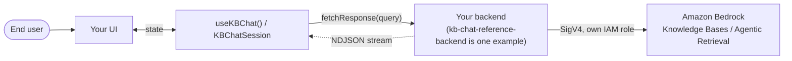
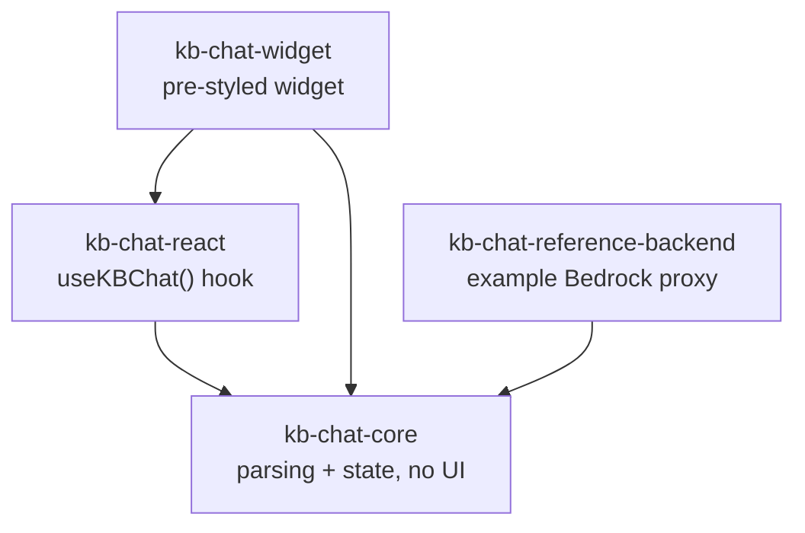

# Architecture

## Runtime data flow



Only the backend holds AWS credentials and calls Bedrock. The browser-side pieces
never touch AWS — they call a customer-supplied `fetchResponse(query)` and render
whatever the backend streams back as newline-delimited JSON (NDJSON).

## Package dependencies



Build `kb-chat-core` and `kb-chat-react` first — the widget and backend resolve them
from `dist/`, not from source.

## NDJSON wire format

The backend translates whatever Bedrock returns into a stream of NDJSON events, one
per line, which `kb-chat-core` parses into a single `KBChatState`:

```jsonl
{"type":"stage","label":"Iteration 1 in progress...","live":true}
{"type":"text","delta":"The API key can be reset from the account settings page."}
{"type":"citation","citation":{"id":"c1","snippetId":"s1"}}
{"type":"snippet","snippet":{"id":"s1","title":"API Key Management","uri":"https://docs.example.com/api-keys","excerpt":"..."}}
{"type":"done"}
```

`stage` events are only relevant for Agentic Retrieval (multi-step retrieval
progress); a backend using plain `RetrieveAndGenerate` never emits them.
